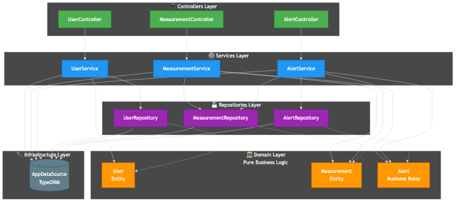
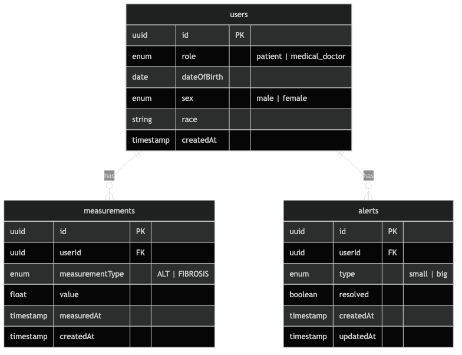
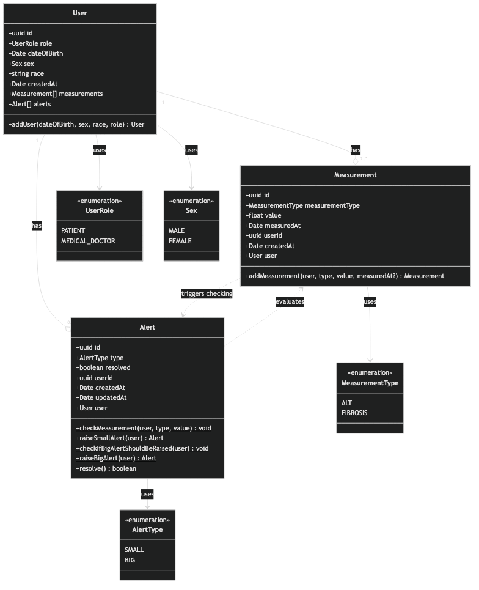

# alerting-app-example

This is a training repository showing an example implementation of a healthcare app following EDA, DDD and event sourcing.

# Requirements


## Context

- Janek owns a company called “JanMed” (previously “JanWątroba”)
- Janek has a network of ten laboratories in Poland
- The laboratories have technicians and equipment necessary for liver examinations
- Janek wants to digitize the process of monitoring patients’ health and lay off part of the staff

## Acceptance criterias

- **AC1.** My system receives the patient’s test results: alanine aminotransferase (ALT – U/L) and liver fibrosis level on the METAVIR scale F0–F4 from elastography.
- **AC2.** ALT above 35 U/L for women / 45 U/L for men generates a small alert.
- **AC3.** Fibrosis levels F1, F2, F3, and F4 generate a small alert.
- **AC4.** After three consecutive alarming ALT–fibrosis result pairs, taken at intervals of at least one month, we calculate the liver cancer risk level using the formula:**(patient age / 70) \* (median fibrosis / 4) \* (mean ALT / \[last ALT result + first ALT result\])**
- **AC5.** If the calculated liver cancer risk level is greater than 0.3, we generate a large alert.
- **AC6.** A doctor may resolve a large alert → this resolves all small alerts.
- **AC7.** A doctor may resolve small alerts, but when a large alert appears, small alerts cannot be resolved.
- **AC8.** No new alerts can be generated if a large alert has not been resolved.
- **AC9**. The price for an ALT test is 30 PLN.
- **AC10**. The price for elastography is 300 PLN.
- **AC11**. Elderly patients receive a 10% discount.
- **AC12**. Patients with a small alert receive a 5% discount.
- **AC13**. Patients with a big alert receive a 15% discount.
- **AC14**. Small-alert and big-alert discounts do not combine with each other.
- **AC15**. The elderly discount can be combined with either the small-alert or big-alert discount.

# Implementation

This implementation follows a **layered architecture** pattern with the following structure:

```
src/
├── controllers/     # HTTP request handlers (API layer)
├── services/        # Business logic orchestration
├── domain/          # Domain entities with business rules
├── repositories/    # Data access layer
└── core/
    └── infrastructure/  # Database and server configuration
```

## Layered Architecture



**Clean Architecture Flow:**
- **Controllers** → **Services** (HTTP request handling)
- **Services** → **Domain** (uses pure business logic)
- **Services** → **Repositories** (data persistence)
- **Services** → **Infrastructure** (direct database access when needed)
- **Repositories** → **Infrastructure** (database operations)

**✅ Clean Architecture Achieved:**
The Domain layer now contains only pure business logic with NO infrastructure dependencies. All database operations have been moved to the Services layer, following clean architecture principles:

- **Domain entities** (User, Measurement, Alert) are pure TypeORM entities with no database access
- **Alert domain** contains pure business rules as static methods (e.g., `shouldTriggerAltAlert()`, `calculateLiverCancerRisk()`)
- **Services layer** orchestrates all infrastructure interactions and coordinates between domain logic and data persistence
- **Clear separation of concerns** enables easy testing and maintainability

## Technology Stack

- **Node.js** with **TypeScript**
- **Fastify** - Web framework
- **TypeORM** - Database ORM with decorators
- **PostgreSQL** - Database

## Database Schema



The database consists of three main tables with the following relationships:
- **users** ← **measurements** (one-to-many)
- **users** ← **alerts** (one-to-many)

To regenerate the diagram from the Mermaid source file:
```bash
npm run docs:diagrams
```

## Domain Entities



The domain layer contains three main entities with their business logic:

### User
- Represents patients and medical doctors
- Includes demographics (dateOfBirth, sex, race)
- Has a static `addUser()` method for creating users
- Roles: `PATIENT` or `MEDICAL_DOCTOR`
- Sex: `MALE` or `FEMALE`

### Measurement
- Stores ALT and fibrosis test results
- Has a static `addMeasurement()` method that automatically triggers alert checking
- Injects Alert entity to evaluate if measurements should generate alerts
- Types: `ALT` (alanine aminotransferase) or `FIBROSIS` (METAVIR scale)

### Alert
- Manages small and big alerts
- Implements all alert logic (AC2-AC8):
  - `checkMeasurement()` - Evaluates if a measurement triggers alerts
  - `raiseSmallAlert()` - Creates small alerts
  - `checkIfBigAlertShouldBeRaised()` - Calculates risk and creates big alerts
  - `raiseBigAlert()` - Creates big alerts
  - `resolve()` - Handles alert resolution with proper validation
- Types: `SMALL` or `BIG`

**Key Relationships:**
- `Measurement.addMeasurement()` → calls `Alert.checkMeasurement()` automatically
- One User has many Measurements and Alerts (one-to-many relationships)

# Setup

## Dependencies

Run docker compose to start needed dependencies:

```bash
docker compose up -d
```

## Environment Configuration

Copy the example environment file and configure your database connection:

```bash
cp .env.example .env
```

Edit `.env` with your database credentials (defaults are set for the docker compose setup).

## Installation

Install npm dependencies:

```bash
npm install
```

## Running the Application

Start the server:

```bash
npm start
```

The API will be available at `http://localhost:3000`.

## Development

```bash
# Type checking
npm run tsc

# Linting
npm run lint

# Format checking
npm run format
```

# API Endpoints

## Users

- `POST /users` - Create a new user
  ```json
  {
    "dateOfBirth": "1980-01-15",
    "sex": "male",
    "race": "caucasian",
    "role": "patient"
  }
  ```
- `GET /users` - Get all users
- `GET /users/:id` - Get a specific user
- `DELETE /users/:id` - Delete a user

## Measurements

- `POST /measurements` - Add a new measurement (automatically triggers alert checking)
  ```json
  {
    "userId": "uuid",
    "type": "ALT",
    "value": 50,
    "measuredAt": "2025-01-15T10:00:00Z"
  }
  ```
- `GET /measurements` - Get all measurements
- `GET /measurements/:id` - Get a specific measurement
- `GET /users/:userId/measurements` - Get all measurements for a user
- `DELETE /measurements/:id` - Delete a measurement

## Alerts

- `GET /alerts` - Get all alerts
- `GET /alerts/:id` - Get a specific alert
- `GET /users/:userId/alerts` - Get all alerts for a user
- `GET /users/:userId/alerts/unresolved` - Get unresolved alerts for a user
- `POST /alerts/resolve` - Resolve an alert
  ```json
  {
    "alertId": "uuid"
  }
  ```
- `DELETE /alerts/:id` - Delete an alert
