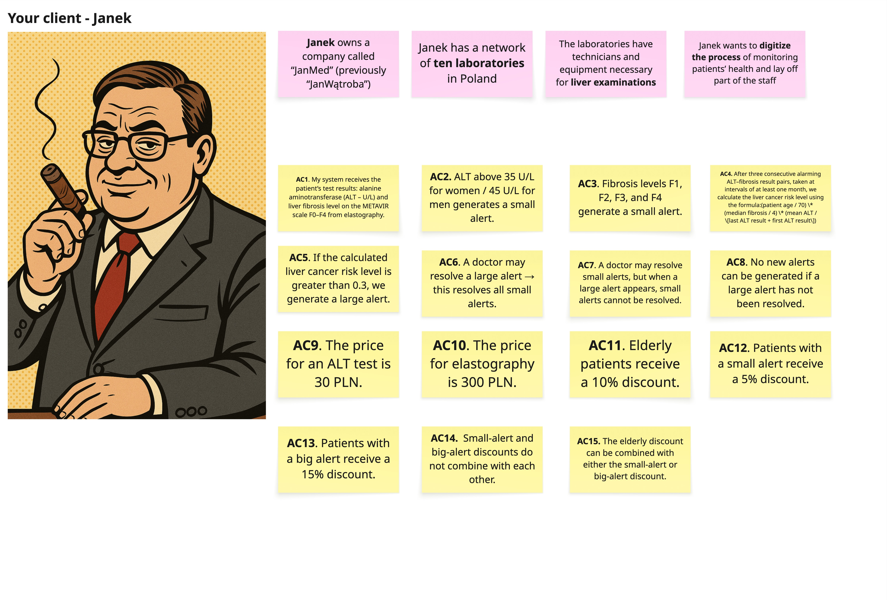
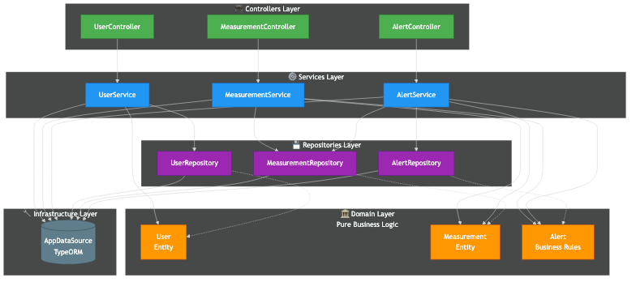
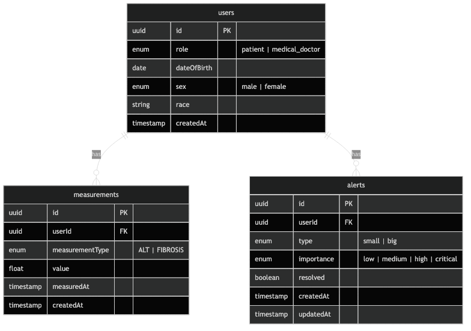
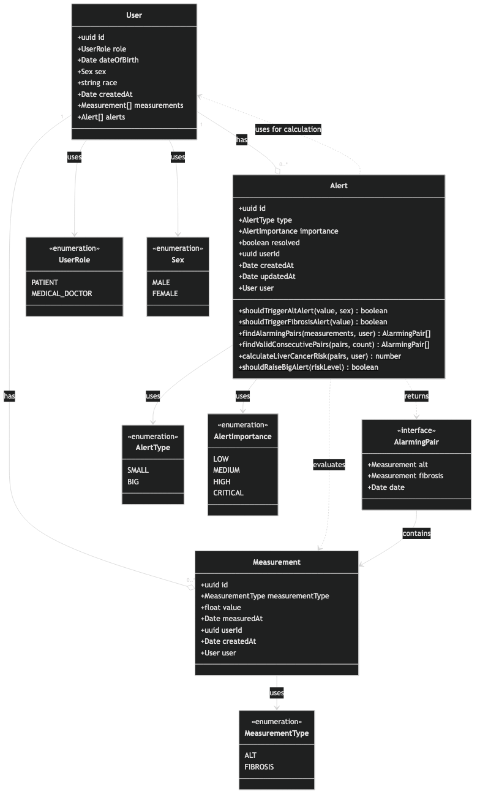

# alerting-app-example

This is a training repository showing an example implementation of a healthcare app following EDA, DDD and event sourcing.

# Requirements



## Context

- Janek owns a company called “JanMed” (previously “JanWątroba”)
- Janek has a network of ten laboratories in Poland
- The laboratories have technicians and equipment necessary for liver examinations
- Janek wants to digitize the process of monitoring patients’ health and lay off part of the staff

## Acceptance criterias

- **AC1.** My system receives the patient’s test results: alanine aminotransferase (ALT – U/L) and liver fibrosis level on the METAVIR scale F0–F4 from elastography.
- **AC2.** ALT above 35 U/L for women / 45 U/L for men generates a small alert.
- **AC3.** Fibrosis levels F1, F2, F3, and F4 generate a small alert.
- **AC4.** After three consecutive alarming ALT–fibrosis result pairs, taken at intervals of at least one month, we calculate the liver cancer risk level using the formula:**(patient age / 70) \* (median fibrosis / 4) \* (mean ALT / \[last ALT result + first ALT result\])**
- **AC5.** If the calculated liver cancer risk level is greater than 0.3, we generate a large alert.
- **AC6.** A doctor may resolve a large alert → this resolves all small alerts.
- **AC7.** A doctor may resolve small alerts, but when a large alert appears, small alerts cannot be resolved.
- **AC8.** No new alerts can be generated if a large alert has not been resolved.
- **AC9**. The price for an ALT test is 30 PLN.
- **AC10**. The price for elastography is 300 PLN.
- **AC11**. Elderly patients receive a 10% discount.
- **AC12**. Patients with a small alert receive a 5% discount.
- **AC13**. Patients with a big alert receive a 15% discount.
- **AC14**. Small-alert and big-alert discounts do not combine with each other.
- **AC15**. The elderly discount can be combined with either the small-alert or big-alert discount.

# Implementation

This implementation follows a **layered architecture** pattern with the following structure:

```
src/
├── controllers/     # HTTP request handlers (API layer)
├── services/        # Business logic orchestration
├── domain/          # Domain entities with business rules
├── repositories/    # Data access layer
└── core/
    └── infrastructure/  # Database and server configuration
```

## Layered Architecture



**Clean Architecture Flow:**

- **Controllers** → **Services** (HTTP request handling)
- **Services** → **Domain** (uses pure business logic)
- **Services** → **Repositories** (data persistence)
- **Services** → **Infrastructure** (direct database access when needed)
- **Repositories** → **Infrastructure** (database operations)

**✅ Clean Architecture Achieved:**
The Domain layer now contains only pure business logic with NO infrastructure dependencies. All database operations have been moved to the Services layer, following clean architecture principles:

- **Domain entities** (User, Measurement, Alert) are pure TypeORM entities with no database access
- **Alert domain** contains pure business rules as static methods (e.g., `shouldTriggerAltAlert()`, `calculateLiverCancerRisk()`)
- **Services layer** orchestrates all infrastructure interactions and coordinates between domain logic and data persistence
- **Clear separation of concerns** enables easy testing and maintainability

## Technology Stack

- **Node.js** with **TypeScript**
- **Fastify** - Web framework
- **TypeORM** - Database ORM with decorators
- **PostgreSQL** - Database

## Database Schema



The database consists of three main tables with the following relationships:

- **users** ← **measurements** (one-to-many)
- **users** ← **alerts** (one-to-many)

To regenerate the diagram from the Mermaid source file:

```bash
npm run docs:diagrams
```

## Domain Entities



The domain layer contains three main entities with their business logic:

### User

- Represents patients and medical doctors
- Includes demographics (dateOfBirth, sex, race)
- Has a static `addUser()` method for creating users
- Roles: `PATIENT` or `MEDICAL_DOCTOR`
- Sex: `MALE` or `FEMALE`

### Measurement

- Stores ALT and fibrosis test results
- Has a static `addMeasurement()` method that automatically triggers alert checking
- Injects Alert entity to evaluate if measurements should generate alerts
- Types: `ALT` (alanine aminotransferase) or `FIBROSIS` (METAVIR scale)

### Alert

- Manages small and big alerts
- Implements all alert logic (AC2-AC8):
  - `checkMeasurement()` - Evaluates if a measurement triggers alerts
  - `raiseSmallAlert()` - Creates small alerts
  - `checkIfBigAlertShouldBeRaised()` - Calculates risk and creates big alerts
  - `raiseBigAlert()` - Creates big alerts
  - `resolve()` - Handles alert resolution with proper validation
- Types: `SMALL` or `BIG`

**Key Relationships:**

- `Measurement.addMeasurement()` → calls `Alert.checkMeasurement()` automatically
- One User has many Measurements and Alerts (one-to-many relationships)

# Setup

## Dependencies

Run docker compose to start needed dependencies:

```bash
docker compose up -d
```

## Environment Configuration

Copy the example environment file and configure your database connection:

```bash
cp .env.example .env
```

Edit `.env` with your database credentials (defaults are set for the docker compose setup).

## Installation

Install npm dependencies:

```bash
npm install
```

## Running the Application

Start the server:

```bash
npm start
```

The API will be available at `http://localhost:3000`.

## Development

```bash
# Type checking
npm run tsc

# Linting
npm run lint

# Format checking
npm run format
```

# Architecture Layers

## Controllers Layer

**Responsibility:** HTTP request handling and API endpoints

Controllers act as the entry point for all HTTP requests. They:

- Parse and validate incoming HTTP requests
- Delegate business logic to the Services layer
- Format responses and handle HTTP status codes
- Manage error handling at the API boundary

**Key Controllers:**

### UserController (src/controllers/UserController.ts:16)

Handles user management endpoints:

- User creation with validation of demographics
- User retrieval (single and list)
- User deletion
- Accepts `dateOfBirth`, `sex`, `race`, and `role` parameters

### MeasurementController (src/controllers/MeasurementController.ts)

Manages measurement data endpoints:

- Records new ALT and fibrosis measurements
- Retrieves measurements by ID or user
- Automatically triggers alert checking on new measurements
- Supports measurement deletion

### AlertController (src/controllers/AlertController.ts)

Handles alert-related operations:

- Retrieves alerts (all, by user, unresolved only)
- Processes alert resolution requests
- Provides alert deletion functionality

## Services Layer

**Responsibility:** Business logic orchestration and infrastructure coordination

Services coordinate between domain logic, repositories, and infrastructure. They:

- Orchestrate complex business workflows
- Coordinate between multiple repositories
- Manage transactions and data persistence
- Implement cross-cutting concerns (AC1-AC15)
- Call pure domain logic for business rule validation

**Key Services:**

### UserService (src/services/UserService.ts:5)

Orchestrates user-related operations:

- Creates users via direct database repository access
- Coordinates user retrieval through UserRepository
- Manages user lifecycle (creation, retrieval, deletion)
- No complex business logic - primarily CRUD operations

### MeasurementService (src/services/MeasurementService.ts:7)

Coordinates measurement recording and alert triggering:

- Validates user existence before creating measurements
- Persists measurements to database
- Triggers AlertService to check for alert conditions (AC2-AC8)
- Coordinates between UserRepository, MeasurementRepository, and AlertService
- Implements the critical workflow: measurement → alert checking

### AlertService (src/services/AlertService.ts:8)

Implements core alert business logic and workflows (AC2-AC8):

- **Alert Generation:**
  - `checkMeasurement()` - Evaluates measurements using domain rules
  - Calls `Alert.shouldTriggerAltAlert()` and `Alert.shouldTriggerFibrosisAlert()`
  - Prevents new alerts when unresolved big alert exists (AC8)
- **Risk Calculation:**
  - `checkIfBigAlertShouldBeRaised()` - Orchestrates big alert creation
  - Retrieves measurements, finds alarming pairs, validates consecutive pairs
  - Calculates liver cancer risk using domain logic
  - Creates big alert if risk > 0.3 (AC5)
- **Alert Resolution:**
  - `resolveAlert()` - Handles resolution with proper business rules
  - Big alert resolution cascades to all small alerts (AC6)
  - Prevents small alert resolution when big alert exists (AC7)
- Coordinates between AlertRepository and MeasurementRepository

## Domain Layer

**Responsibility:** Pure business logic and domain rules

The domain layer contains pure business logic with NO infrastructure dependencies. Domain entities:

- Are TypeORM entities (decorators for persistence mapping)
- Contain static methods for pure business rule validation
- Have no database access or repository dependencies
- Implement core business formulas and calculations
- Follow Domain-Driven Design principles

**Key Domain Entities:**

### User (src/domain/User.ts)

Represents patients and medical doctors:

- **Properties:** `dateOfBirth`, `sex`, `race`, `role`
- **Enums:** `Sex` (MALE/FEMALE), `UserRole` (PATIENT/MEDICAL_DOCTOR)
- **Relationships:** One-to-many with Measurements and Alerts
- No business logic methods - pure data entity

### Measurement (src/domain/Measurement.ts)

Stores test results:

- **Properties:** `measurementType`, `value`, `measuredAt`, `userId`
- **Enum:** `MeasurementType` (ALT, FIBROSIS)
- **Relationship:** Many-to-one with User
- No business logic - service layer triggers alert checking

### Alert (src/domain/Alert.ts:24)

Contains pure alert business rules (AC2-AC5):

- **Properties:** `type`, `resolved`, `userId`, `createdAt`
- **Enum:** `AlertType` (SMALL, BIG)
- **Static Business Logic Methods:**
  - `shouldTriggerAltAlert(value, sex)` - AC2: Checks ALT thresholds (35 U/L women, 45 U/L men)
  - `shouldTriggerFibrosisAlert(value)` - AC3: Validates fibrosis levels F1-F4
  - `findAlarmingPairs(measurements, user)` - AC4: Identifies alarming ALT-fibrosis pairs
  - `findValidConsecutivePairs(pairs, count)` - AC4: Finds 3+ pairs at least 1 month apart
  - `calculateLiverCancerRisk(pairs, user)` - AC4: Calculates risk using formula
  - `shouldRaiseBigAlert(risk)` - AC5: Determines if risk > 0.3
- All methods are pure functions - no side effects or database access

## Repositories Layer

**Responsibility:** Data access and persistence abstraction

Repositories provide a clean abstraction over database operations. They:

- Wrap TypeORM repository operations
- Provide domain-specific query methods
- Abstract database implementation details
- Return domain entities
- Enable easy mocking for testing

**Key Repositories:**

### UserRepository (src/repositories/UserRepository.ts:4)

Data access for User entities:

- `findById(id)` - Retrieves single user
- `findAll()` - Lists all users
- `save(user)` - Persists user
- `delete(id)` - Removes user
- Simple CRUD operations wrapper

### MeasurementRepository (src/repositories/MeasurementRepository.ts:4)

Data access for Measurement entities:

- `findById(id)` - Retrieves single measurement
- `findByUserId(userId)` - Gets user measurements ordered by date (DESC)
- `findAll()` - Lists all measurements
- `save(measurement)` - Persists measurement
- `delete(id)` - Removes measurement
- Includes ordering logic for temporal queries

### AlertRepository (src/repositories/AlertRepository.ts:4)

Data access for Alert entities with specialized queries:

- `findById(id)` - Retrieves single alert
- `findByUserId(userId)` - Gets user alerts ordered by creation date
- `findUnresolvedByUserId(userId)` - Filters unresolved alerts for user
- `findUnresolvedBigAlertByUserId(userId)` - Specialized query for AC7/AC8
- `findAll()` - Lists all alerts
- `save(alert)` - Persists alert
- `delete(id)` - Removes alert
- Supports complex business rule queries

## Architecture Flow Example

**Adding a Measurement (AC1-AC8):**

1. **Controller** (`MeasurementController`) receives POST request
2. **Controller** validates input and calls `MeasurementService.addMeasurement()`
3. **Service** (`MeasurementService`) validates user exists via `UserRepository`
4. **Service** creates and persists measurement via database repository
5. **Service** triggers `AlertService.checkMeasurement()`
6. **Service** (`AlertService`) checks for unresolved big alert (AC8)
7. **Service** calls domain logic: `Alert.shouldTriggerAltAlert()` (AC2)
8. **Service** calls domain logic: `Alert.shouldTriggerFibrosisAlert()` (AC3)
9. **Service** retrieves measurements via `MeasurementRepository`
10. **Service** calls domain logic: `Alert.findAlarmingPairs()` (AC4)
11. **Service** calls domain logic: `Alert.findValidConsecutivePairs()` (AC4)
12. **Service** calls domain logic: `Alert.calculateLiverCancerRisk()` (AC4)
13. **Service** calls domain logic: `Alert.shouldRaiseBigAlert()` (AC5)
14. **Service** persists alerts if conditions met
15. **Controller** returns HTTP response

# API Endpoints

## Users

- `POST /users` - Create a new user
  ```json
  {
    "dateOfBirth": "1980-01-15",
    "sex": "male",
    "race": "caucasian",
    "role": "patient"
  }
  ```
- `GET /users` - Get all users
- `GET /users/:id` - Get a specific user
- `DELETE /users/:id` - Delete a user

## Measurements

- `POST /measurements` - Add a new measurement (automatically triggers alert checking)
  ```json
  {
    "userId": "uuid",
    "type": "ALT",
    "value": 50,
    "measuredAt": "2025-01-15T10:00:00Z"
  }
  ```
- `GET /measurements` - Get all measurements
- `GET /measurements/:id` - Get a specific measurement
- `GET /users/:userId/measurements` - Get all measurements for a user
- `DELETE /measurements/:id` - Delete a measurement

## Alerts

- `GET /alerts` - Get all alerts
- `GET /alerts/:id` - Get a specific alert
- `GET /users/:userId/alerts` - Get all alerts for a user
- `GET /users/:userId/alerts/unresolved` - Get unresolved alerts for a user
- `POST /alerts/resolve` - Resolve an alert
  ```json
  {
    "alertId": "uuid"
  }
  ```
- `DELETE /alerts/:id` - Delete an alert
